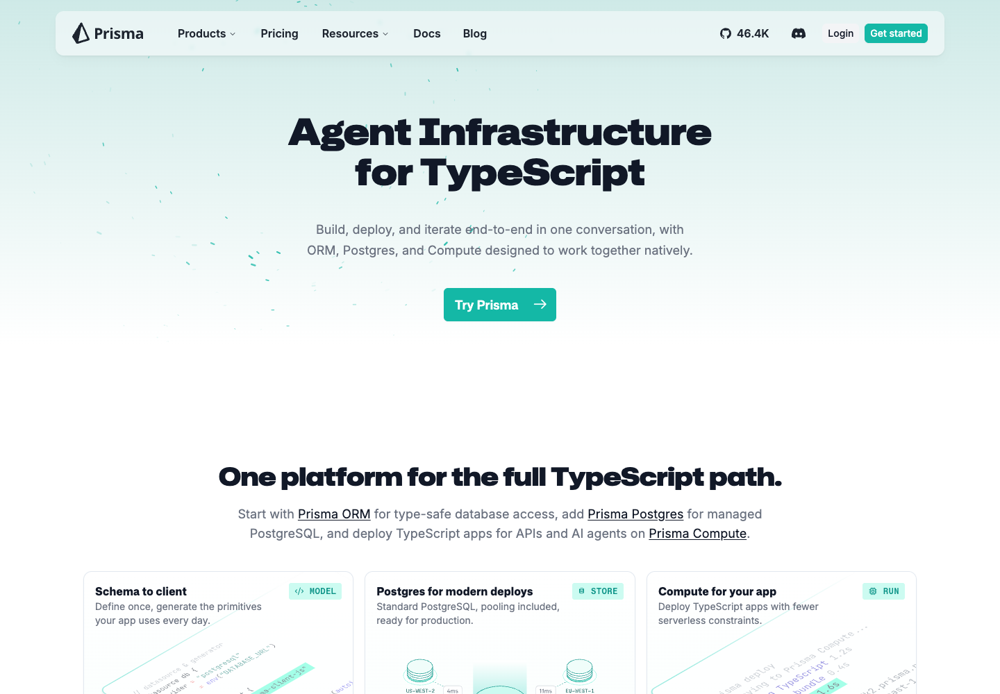
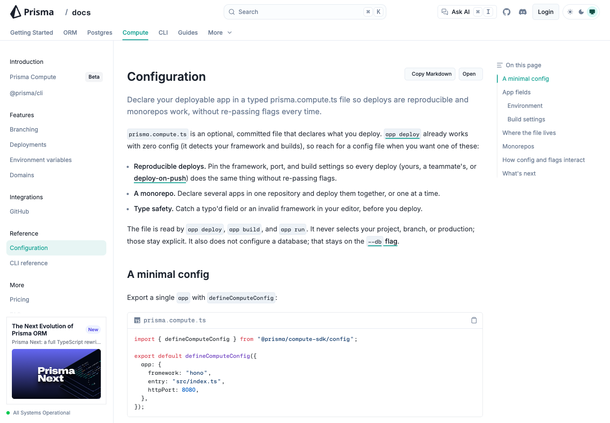
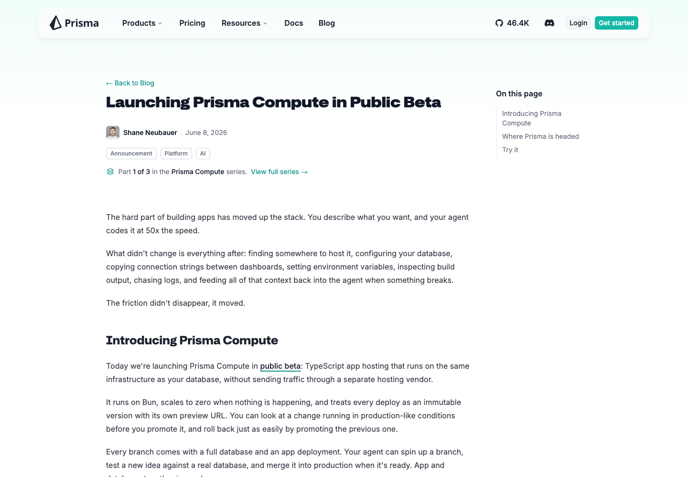

# DEPLOYED TO COMPUTE

This repository has been refactored and deployed to Prisma Compute using the monorepo app configuration in [`prisma.compute.ts`](prisma.compute.ts). The deployment uses three Compute apps: one for the homepage shell, one for docs, and one for the blog.

## Live URLs

| Surface | URL | Notes |
| --- | --- | --- |
| Homepage | [https://cmqkpxx900dea0ddxaoyu2s8l.fra.prisma.build/](https://cmqkpxx900dea0ddxaoyu2s8l.fra.prisma.build/) | Site app deployed from `apps/site`. |
| Docs | [https://cmqkoe8hg0cyt03l79u7thj20.fra.prisma.build/docs](https://cmqkoe8hg0cyt03l79u7thj20.fra.prisma.build/docs) | Docs app deployed from `apps/docs`. The homepage rewrites `/docs` to this Compute app. |
| Blog | [https://cmqkpw54o0yp4zndvj3zei5ml.fra.prisma.build/blog](https://cmqkpw54o0yp4zndvj3zei5ml.fra.prisma.build/blog) | Blog app deployed from `apps/blog`. The homepage rewrites `/blog` to this Compute app. |

Representative route inventory and verification results are in [`docs/compute-deploy/route-inventory.md`](docs/compute-deploy/route-inventory.md).

## Screenshots

### Homepage



### Docs



### Blog



## Obstacles Report

| Obstacle | Resolution |
| --- | --- |
| The repository is a pnpm/Turbo monorepo, while Prisma Compute needs an explicit deploy shape. | Added [`prisma.compute.ts`](prisma.compute.ts) with three Compute apps: `site`, `docs`, and `blog`, each with its own root, build command, port, framework adapter, and environment. |
| The existing Next.js apps were not configured for Compute's standalone deployment requirements. | Added Compute-gated `output: "standalone"`, `outputFileTracingRoot`, and `turbopack.root` settings in the site, docs, and blog Next configs. These settings are enabled only when `PRISMA_COMPUTE_DEPLOY=true`, so normal local and production workflows keep their existing behavior. |
| Existing static asset prefixes such as `/site-static`, `/docs-static`, and `/blog-static` broke direct Compute asset loading. | Omitted those prefixes during Compute builds so the deployed apps can serve Next static assets from their own Compute origins. |
| Turbo was pruning deployment-only environment variables from builds. | Added `PRISMA_COMPUTE_DEPLOY`, `NEXT_DOCS_ORIGIN`, and `NEXT_BLOG_ORIGIN` to the Turbo build environment and set `PRISMA_COMPUTE_DEPLOY=true` directly in each Compute build command. |
| The homepage production build normally requires explicit blog and docs origins. | Bypassed that guard only for Compute builds, then configured the site Compute app with docs and blog origins so `/docs` and `/blog` can route to the deployed Compute apps. |
| Blog and docs search initialized the Mixedbread client at module load, which fails without `MIXEDBREAD_API_KEY`. | Changed both search API routes to lazily initialize Mixedbread only when a key exists. Missing keys now return an empty search result instead of failing the build or runtime. |
| Docs generated a large number of static routes during the Compute build. | Added Compute-specific `generateStaticParams()` guards for docs pages, LLMS routes, and OG routes so the Compute deployment can build a minimal runtime artifact instead of a full static export. |
| The blog `public` directory was too large for a practical Compute deployment. | Removed 152 pre-2024 blog posts and their matching media directories from `apps/blog/content/blog` and `apps/blog/public`, leaving 112 posts from 2024 onward. |
| The docs Next standalone server exceeded Compute beta runtime limits when served directly. | Switched docs to a no-proxy Bun static runtime generated by [`scripts/compute-build-static-app.mjs`](scripts/compute-build-static-app.mjs). The script builds the local Next app, snapshots the verified docs routes, and embeds the required HTML/assets into `.compute/server.ts`. |
| Docs section index pages such as `/docs/compute`, `/docs/orm`, and `/docs/guides` returned `Not found` because the first static runtime only embedded a small hand-written route list. | Updated the docs static builder to derive routes from docs frontmatter URLs, prioritize all Compute docs and major section indexes, and deploy a 181-page current-docs subset that was verified live. |
| Capturing every current docs route produced a 101.5 MB Compute artifact that deployed but never became reachable from its generated URL. | Capped the generated docs subset to 180 prioritized current docs routes. The resulting 57.7 MB artifact deployed successfully and serves `/docs/compute` plus the verified route subset. |
| The blog Next artifact still risked unpacking large media, even after pruning older content. | Switched blog to the same no-proxy Bun static runtime. The original failing blog post URL and representative current blog routes are served directly by Compute from embedded snapshots/assets. |
| Prisma Compute's Bun adapter bundles only the configured entrypoint and does not ship sibling generated files automatically. | Embedded the captured HTML, selected public assets, encoded `_next/static` assets, RSS, OG image, and favicon data into the generated `.compute/server.ts` files. |
| Encoded Next font asset URLs such as `%5Bwdth%2C...%5D` returned 404 from the first static runtime. | Added encoded path aliases for embedded static assets so browser requests with percent-encoded filenames resolve correctly. |
| The docs sidebar promo image was client-rendered and not visible as a plain HTML asset reference. | Added `/docs/imgs/sidebar-banners/prisma-next.png` to the docs static route inventory so the screenshot renders cleanly. |
| The old blog post URL reported by the user failed after the no-proxy change. | Rebuilt and redeployed the blog as a static Compute app. The exact `launching-prisma-compute-public-beta` URL, including tracking query parameters, now returns `200`. |
| A newer 2026 blog post returned `Not found` because the blog static runtime still relied on a small hand-written route list. | Updated the blog static builder to derive recent post routes from blog frontmatter, include dependent author and series pages for those posts, and add the blog series index. The reported post, its tracking-query URL, its media asset, its author page, its series page, and the homepage rewrite now return `200`. |
| Expanding the blog snapshot to 52 source routes produced a 330.5 MB Compute artifact that deployed but returned the platform `Service not found` page. | Capped the generated blog post subset to the 20 newest retained posts plus their author/series dependencies. The resulting 42-source-route, 230.1 MB deployment is reachable and passed live verification across all generated source routes plus query/rewrite checks. |
| The local machine hit disk pressure while iterating on Next/Turbo artifacts. | Removed generated cache and temporary deployment artifacts that were not needed, then kept `.compute`, `.playwright-cli`, and local Prisma cache output ignored. |
| The Compute CLI surfaced database URL warnings even though these apps do not need a database connection for this deployment. | Left database integration disabled and deployed without a Compute database binding. The warnings were non-blocking for static homepage, docs, and blog verification. |
| A Bun-powered CLI invocation failed while building docs because `tsx` could not resolve a nested CJS package under Bun. | Used the Node-backed `bunx @prisma/cli@latest` invocation for Compute deploys while still letting Compute build the generated Bun app runtime. |
| Preview-branch deployment was not necessary for this migration proof and introduced extra routing friction. | Used a dedicated Compute project named `web-compute-migration` with production branch `main` and deployed the three apps there. |
| Duplicate preview services created during iteration made app-name lookup ambiguous. | Targeted the production `main` branch with explicit app names and verified the stable production URLs after each deploy. |
| The service token needed to be used for deployment without leaking credentials into source control. | Used the token only through the local CLI environment. The token is not stored in the repository or README. |

No requests are proxied to the existing live site. The site app is a Next standalone Compute app. The docs and blog apps are no-proxy Bun static runtimes generated from local Next builds and verified representative routes.

# Prisma Documentation

[](https://github.com/prisma/docs/blob/main/CONTRIBUTING.md) [](https://discord.com/invite/prisma-937751382725886062?utm_source=twitter&utm_medium=bio&dub_id=0HxLEKaaOg6pL0OL)

This repository is a **pnpm monorepo** containing the Prisma documentation, blog, design system docs, and shared packages.

## Repository structure

| Path | Description |
|------|--------------|
| `apps/docs` | Prisma documentation site (Next.js + Fumadocs) |
| `apps/blog` | Prisma blog |
| `apps/eclipse` | Eclipse design system documentation |
| `packages/eclipse` | Eclipse design system component library (`@prisma/eclipse`) |
| `packages/ui` | Shared UI components and utilities (`@prisma-docs/ui`) |

See each app’s `README.md` for more detail.
See [ARCHITECTURE.md](ARCHITECTURE.md) for the cross-app multi-zone overview.

## Contributing

New contributors are welcome. Read the [contributing guide](CONTRIBUTING.md) before submitting changes.

## Run locally

From the repository root:

```bash
pnpm install
pnpm dev
```

This starts all apps via Turbo:

- **Site** — http://localhost:3000  
- **Docs** — http://localhost:3001  
- **Blog** — http://localhost:3002  
- **Eclipse** — http://localhost:3003  

To run a single app:

```bash
pnpm --filter docs dev      # docs only
pnpm --filter blog dev      # blog only
pnpm --filter eclipse dev   # eclipse design system docs only
```

## Build

```bash
pnpm build
```

To build and serve the docs site:

```bash
pnpm --filter docs build
pnpm --filter docs start
```

## Scripts

| Script | Description |
|--------|-------------|
| `pnpm lint:links` | Validate internal and external links (docs) |
| `pnpm lint:code` | Lint code blocks in MDX (docs) |
| `pnpm lint:spellcheck` | Spell-check content (docs) |
| `pnpm check` | Run formatting and lint fixes across all workspaces |

## Content

- **Docs** — `apps/docs/content/docs/` (latest), `apps/docs/content/docs.v6/` (versioned). Sidebar structure comes from `meta.json` in each folder. See [Fumadocs collections](https://fumadocs.dev/docs/mdx/collections).
- **Blog** — `apps/blog/content/blog/` (MDX with authors, dates, hero images).
- **Eclipse** — `apps/eclipse/content/design-system/` (component docs).

## Note on formatting

`.md` and `.mdx` files are not formatted by Prettier because they use [MDX 3](https://mdxjs.com/blog/v3/), which Prettier does not support. See [prettier/prettier#12209](https://github.com/prettier/prettier/issues/12209).
