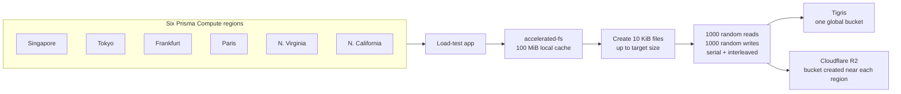

We set out to build [Prisma Compute](/blog/launching-prisma-compute-public-beta) because we were tired of the limited capabilities of existing serverless compute offerings. Prisma Compute runs Bun in microVMs and uses automatic memory snapshotting to deliver much of the feel of a long-running server with the pricing model of serverless.

We were also inspired by Bun's batteries-included approach. Over time, we want Prisma Compute to offer integrated solutions for email, auth, object storage, and more. This post is about one of those pieces: object storage.

I was on a 16-hour flight across the Atlantic on the way to San Francisco for AI Engineering World Fair, with Starlink working well enough to keep shipping. That made it a good time to evaluate object storage providers for the kind of workloads we expect Prisma Compute to run.

## What we cared about

AWS S3 set the standard for object storage, including the now-familiar durability target that the rest of the industry compares itself against. For Prisma Compute, though, the primary selection criteria are more practical: price and performance.

We operate outside the AWS ecosystem, so the egress fees of the major clouds matter. The exact bill depends on region, tier, and volume, but public list prices still put common internet egress paths in the same rough cost class: [AWS S3 pricing](https://aws.amazon.com/s3/pricing/) shows examples at `$0.09/GB`, [Azure bandwidth pricing](https://azure.microsoft.com/en-us/pricing/details/bandwidth/) lists `$0.087/GB` for the next 10 TB from North America and Europe on the Premium Global Network, and [Google Cloud Storage pricing](https://cloud.google.com/storage/pricing) treats network usage as its own pricing component.

That makes object stores with no egress charges especially interesting. [Cloudflare R2](https://developers.cloudflare.com/r2/pricing/) and [Tigris](https://www.tigrisdata.com/pricing/) both publish no-egress pricing, both are S3-compatible, and both are designed for large-scale usage outside a single hyperscaler. So those were the two providers I tested.

## The workload

We are experimenting with ways to let agents work with large amounts of data on Prisma Compute. One experiment is [`accelerated-fs`](https://github.com/prisma/accelerated-fs), a virtual filesystem implemented in TypeScript that uses a small local cache to provide fast access to a much larger dataset in remote object storage.

Think of an agent that needs to store and index all of your email locally so it can grep through it quickly. The useful interface is a filesystem. The durable backing store can be object storage. The hard part is making that feel fast when the working set is bigger than local disk.

That made `accelerated-fs` a realistic benchmark target. I had Codex create a small load-test app, deploy it to all six Prisma Compute regions, and collect the results.

For each provider and region, the benchmark did the same work:

1. Create `10 KiB` files up to a configured dataset size.
2. Run `1000` random reads and `1000` random writes.
3. Keep reads and writes serial and interleaved.
4. Repeat the workload for `50 MiB`, `500 MiB`, and `5 GiB`.
5. Use a `100 MiB` local cache.

Tigris supports global buckets, so all regions used the same bucket. For R2, I created the bucket from the benchmark app so the bucket would be placed close to the Prisma Compute region running the test.

## The result

For this workload, Tigris was clearly faster.

The main reason is that this benchmark is latency-sensitive, not just bandwidth-sensitive. After setup, it performs `2000` small serial operations against `10 KiB` files. That punishes every extra remote round trip. Tigris' global bucket model handled that shape much better than R2's regional bucket model, even after we created R2 buckets from each Prisma Compute region.

Here is the averaged data across the six regions:

| Provider | Size | Avg insert | Avg mixed reads/writes | R2/Tigris mixed ratio |
| --- | ---: | ---: | ---: | ---: |
| Tigris | 50 MiB | 3.2s | 109.5s | 1.0x |
| R2 | 50 MiB | 10.2s | 578.7s | 5.3x slower |
| Tigris | 500 MiB | 29.3s | 183.3s | 1.0x |
| R2 | 500 MiB | 99.3s | 688.5s | 3.8x slower |
| Tigris | 5 GiB | 312.2s | 265.8s | 1.0x |
| R2 | 5 GiB | 1079.4s | 860.7s | 3.2x slower |

R2 did correctly create local-ish buckets. Across the benchmark, the R2 locations were `APAC`, `EEUR`, `WEUR`, `ENAM`, and `WNAM`. So the issue was not simply that the bucket landed in the wrong part of the world. For this access pattern, the per-operation latency was still much higher.

## The in-flight benchmark

Since I was already on Starlink, I also ran the same workload from 36,000 feet. This is not the environment Prisma Compute runs in, but it was a useful sanity check: if the bottleneck is small serial operations, the same pattern should show up from a very different network.

| Provider | Run | Insert | Mixed reads/writes | Close |
| --- | ---: | ---: | ---: | ---: |
| Tigris | 1 | 30.586s | 229.079s | 0.744s |
| Tigris | 2 | 38.938s | 267.903s | 1.557s |
| Tigris | avg | 34.762s | 248.491s | 1.150s |
| R2 | 1 | 33.563s | 627.730s | 1.664s |
| R2 | 2 | 37.486s | 609.301s | 1.412s |
| R2 | avg | 35.525s | 618.515s | 1.538s |

The insert phase was almost identical from the plane. The mixed read/write phase was not. Tigris was about `2.5x` faster on the latency-sensitive part of the workload.

## What this means for Prisma Compute

This is not a universal object storage benchmark. It does not say that every app should pick Tigris over R2. If your workload is mostly bulk upload/download, or if your application already lives inside Cloudflare's network, your results may look different.

But this is the workload we care about right now: a virtual filesystem over object storage, with a local cache and a metadata layer, running from any Prisma Compute region. In that shape, the object store sits on the hot path. Every small operation matters.

For `accelerated-fs` and the broader Prisma Compute platform, Tigris is the better fit today. It gave us one durable shared bucket, no egress fees, and much lower latency on the serial small-object workload that agents are likely to create when they use object storage as a backing filesystem.

We will keep benchmarking as we build more of Prisma Compute's integrated platform services. The important part is to benchmark the thing you actually plan to run. In this case, that meant many small files, a cache smaller than the full dataset, and serial operations from the regions where our users' apps will execute.
