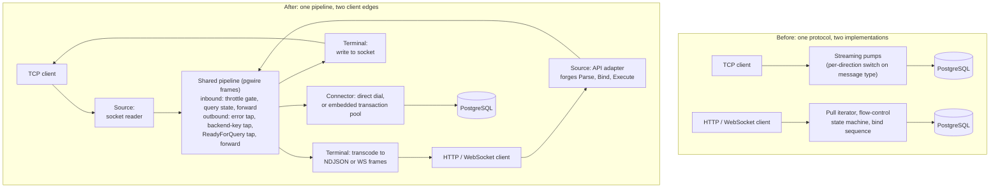

_This is the final post in a four-part series on how Prisma Postgres handles database connectivity. [Post 1](/why-prisma-postgres-needs-a-gateway) introduced the gateway, [Post 2](/why-serverless-apps-are-hard-on-postgres-connections) covered pooling, and [Post 3](/designing-a-streaming-api-for-serverless-postgres) covered the streaming serverless API. This one is about the architecture that ties them together, and it describes work that is still landing._

After reading this post, you'll understand why the team separated protocol processing from connection lifecycle, what the shared pipeline that came out of that separation looks like, and which of its benefits are verified today versus planned.

Start with the idea, because everything else follows from it. A database proxy does two unrelated jobs. One is **connection lifecycle**: accept a socket, negotiate TLS, authenticate the client, find and authenticate to the upstream, and eventually tear everything down in the right order. The other is **protocol processing**: while the connection is up, move Postgres messages between the two ends, look inside a few of them, and decide what to do. The first job runs once per connection, in sequence. The second runs per message, in both directions, concurrently. They have different shapes, and code that mixes them tends to fork every time a new transport or feature arrives.

The gateway from Post 1 mixed them, twice.

## Before: one protocol, two implementations

By 2025 the gateway served two client populations from one process: raw Postgres over TCP, and the HTTP and WebSocket API from Post 3. They had been built on separate timelines. Direct TCP access arrived in mid-2025 and reached general availability that October; the serverless API and its driver were developed alongside it from May 2025 and reached version 1.0 in November; the pooled hostname followed. Each path grew the code it needed when it needed it, and in mid-2026, when the team catalogued the codebase before redesigning it, the shape was clear.

The TCP path implemented the protocol as two streaming pumps, one per direction, in under two hundred lines. Each pump read a five-byte message header, switched on the type byte, and either inspected the message (`ErrorResponse` was buffered and decoded, `BackendKeyData` was captured for cancellation, `ReadyForQuery` flipped a state flag) or streamed the body straight through. The serverless path implemented the same protocol as a pull iterator of nearly eight hundred lines plus a three-hundred-line flow-control state machine, because it had to unpack `RowDescription` and `DataRow` into API results and discard the bookkeeping messages the API client never sees. The catalog counted seven message types that the two implementations treated differently. `ParameterStatus` was forwarded on one path and dropped on the other. An unknown message type streamed through silently on TCP and raised an invariant error on the API. `ReadyForQuery` drove a state machine on TCP and was discarded on the API, which tracked state with a different three-state machine of its own.

Lifecycle diverged the same way. TCP had a hardcoded handshake sequence and a close-cascade teardown; the API built its own startup, consumed backend messages until `ReadyForQuery` in its own loop, and cleaned up through a pool release plus a cancellation goroutine. Query cancellation, which requires a fresh connection carrying the backend's secret key, had one builder and two orchestrations: TCP ran cancels through a bounded worker pool guarded by the circuit breaker, the API spawned an unbounded goroutine per session with no breaker. And the wire-level library the codebase used for message bodies, `pgproto3` from the `pgx` project, had leaked into nineteen files, including the interface that resolved upstreams (its `Connect` took a `pgproto3.StartupMessage`) and the throttling code, which hand-built a `pgproto3.ErrorResponse` to reject a connection.

None of this was a mystery to the people maintaining it. The reason it became urgent was pooling.

## Pooling as the forcing function

Post 2 described today's pooling arrangement: a per-tenant PgBouncer microVM that the gateway routes to. Integrating even that external pooler touched more than a dozen files in the gateway, split into separate development and production provisioners, and required a wrapper type just to get connection-reset behavior right. The team's next step, pooling inside the gateway process, would need something the two-implementation codebase could not offer cheaply: one place that sees every query-like message and every `ReadyForQuery`, on both transports, with the transaction status byte in hand. Transaction pooling is exactly the decision "can this backend be handed to another client now", and that decision needs a single, trustworthy view of the protocol.

That is what turned a cleanup into a redesign. The written goals of the project, which the team calls PPg Proxy Revamped, put it as a common protocol-handling architecture onto which capabilities can be mounted as composable handlers, with streaming as a first-class property rather than a bypass, and with the wire vocabulary owned outright instead of borrowed. The catalog phase, pinned to a specific commit of the old proxy and citing files and line numbers for every claim, was done before any design was written, so that the design could be argued from evidence.

## After: one pipeline, two edges

The new codebase lives in a monorepo as a set of small Go modules, each with one job, assembled at a single composition root that is not allowed to contain business logic. The pieces that matter for this post:

- **`pgwire`** owns the wire protocol. A `Frame` is a five-byte header plus a body, and a body has exactly one of three dispositions: **forward** it (write the header, stream the body, constant memory), **materialize** it into a capped buffer and decode a typed view (the only buffering path, bounded by a maximum size so a peer cannot drive allocation by lying about a length), or **construct** it from readers (how the API path forges `Parse`, `Bind`, and friends). There is no `pgproto3` dependency anywhere in the new tree, and a README rule keeps it that way.
- **`pg-pipeline`** is the streaming phase: a double chain of responsibility, one chain per direction, over `pgwire` frames. The inbound chain (client to database) runs a throttle gate, then a query-state tracker, then the terminal that forwards. The outbound chain (database to client) runs an error tap, a backend-key tap, a `ReadyForQuery` tap, then the terminal. Each handler either calls the next one or does not, and the two chains never call each other; they share one small session object holding the connection's state and its cancel key.
- **`pg-api-adapter`** is how the serverless API rides that pipeline. Rather than a second protocol implementation, it presents an API request as a **virtual Postgres client**: a frame source that forges the extended-query sequence from the request, and a frame sink that transcodes result messages into the client's response format. The pipeline does not know it is talking to anything but a Postgres client. A non-negotiable rule in that module is that it never materializes a body whose size the peer controls.
- **`ppg-routing`** owns lifecycle: the listeners, and the once-through establishment chain (accept, TLS, credentials, resolution, upstream dial and SCRAM) that produces a connection and hands it to the pipeline. TCP and the API differ here by assembly, not by fork.
- **`ppg-pool`** is the embedded transaction pool, discussed below.
- Supporting modules own errors, logging, observability, throttling policy, upstream resolution against the configuration store, and usage metering, each behind a seam the pipeline emits events into rather than importing directly.



_Before and after. Two separate protocol implementations become one pipeline whose only transport-specific parts are the inbound source and the outbound terminal at the client edge. Handler names are the ones used in the new codebase._

The most important consequence is the one the diagram shows: the transport-specific code sits only at the client edge. On TCP, the inbound source is the client socket and the outbound terminal writes to it. On the API, the inbound source is the forging adapter and the outbound terminal is the transcoder. Everything between, the throttle gate, the query-state tracker, the error and key taps, and the metering events they emit, runs the same handler instances on both transports. A forged `Execute` and a native `Execute` are indistinguishable to the throttle gate, which closes a real gap: the old API path checked account holds once at connection time and never again, while TCP re-checked on every query. Now both paths run the same gate.

Backpressure is a consequence of the same structure rather than a mechanism of its own. Each direction is one copy loop with no intermediate buffer, so a slow client blocks the transcoder, which stops reading the database socket. On the request side, the adapter handles one statement at a time and reads the next only when the current one has drained into the database, which replaces the unbounded pipelining queue that Post 3 flagged in the old API path. Every blocking operation carries a deadline, so a genuine stall tears the connection down rather than holding it forever.

## Connection state, defined from the code

The proposal for this series used the words "clean, busy, and dirty" for connection states. Those are not the terms the implementation uses, and it is worth being exact, because the real vocabulary explains how pooling works.

The pipeline tracks each connection as **idle** or **active**: a query-like message from the client (`Query`, `Execute`, or the end of a `COPY`) makes it active, and a `ReadyForQuery` from the database makes it idle. That is enough for the gateway to know whether a cancel request is meaningful when a client disconnects mid-query.

The pool needs more, because it has to know whether a backend can be reused, and that depends on transaction state. Postgres tells it: every `ReadyForQuery` carries a status byte, `I` for idle, `T` for inside a transaction block, `E` for inside a failed one. The pool's per-client session moves through named phases that follow from that byte. It starts **idle** with no backend attached. The first client frame moves it to **claiming**, where it asks the pool for a backend. Once lent, it is **serving**: the session keeps an account, raised by each client frame that demands a reply and lowered by each `ReadyForQuery`, so that a pipelined batch keeps the backend until the last reply. When the account settles and the status byte says `I`, the backend goes back to the pool as reusable and the session returns to idle. When the status byte says `T` or `E`, the backend cannot be shared, because it holds transaction state only this client can finish, so the session moves to **waiting**, the one phase where an idle-in-transaction timer is armed; if that timer fires, the session ends with the same error Postgres itself would use, and the backend is destroyed rather than reused. A **draining** phase handles a refused lend, and **ended** is terminal.

Two details in that design are the kind of thing you only get right by owning the protocol. The `ReadyForQuery` that settles the account cannot simply be forwarded to the client, because by the time it would reach the client the backend has already been returned to the pool and the connection's frame reader has moved on; the session forges a byte-identical `ReadyForQuery` from the status it already decoded. And there is no repair path for a backend in an unknown state: if a session ends mid-request, the backend is destroyed, on the reasoning that guessing at session state is how pools leak one client's `SET` into another client's transaction. The pool's own documentation records that it chose destroy-only after comparing how two other open-source poolers handle the same question.

## Testing became the proof

The old codebase needed a Docker Compose stack, a real Postgres and a real configuration store, to run its default test suite, and it had no fuzz tests. The redesign treated a dependency-free harness as a requirement of the architecture rather than a nicety, and three pieces of it are verifiable in the new tree.

A fake Postgres server, `fakepg`, built on `pgwire`, speaks the real wire protocol including SCRAM authentication with injectable randomness, so an authentication exchange is byte-for-byte deterministic. It runs in two modes. A router maps a SQL string to a canned result. A script is an ordered conversation, and this is the deterministic message sequence the proposal wanted to show, taken from the package's own documentation:

```go
fakepg.New(fakepg.WithBehavior(fakepg.Script{
  fakepg.Expect(fakepg.Parse("", "SELECT 1")),
  fakepg.Expect(fakepg.Tag(pgwire.TagBind)),
  fakepg.Send(fakepg.ParseComplete()),
  fakepg.Send(fakepg.BindComplete()),
  fakepg.Send(fakepg.Rows(cols, rows)),
  fakepg.Send(fakepg.ReadyForQuery()),
}))
```

The server expects the client's `Parse` and `Bind`, then replies with completions, rows, and `ReadyForQuery`; any deviation is an error surfaced to the test. On top of that it ships fault behaviors named for what they exercise: a response that sends part of a message and hangs, one that drips bytes slowly, one that truncates mid-message, one that declares an oversized header, one that emits an error after partial results, and a slow reader that exercises write-side backpressure.

Time is virtualized with Go's `testing/synctest`, so deadline and timeout logic runs against a fake clock, and goroutine coordination in tests uses a small runner primitive that turns an assertion failure inside a spawned goroutine into a test failure instead of a deadlock. Several of the new modules, including the API adapter and the pool, hold statement coverage at one hundred percent and enforce it in CI. An end-to-end suite runs the real gateway against real Postgres containers and the actual published `@prisma/ppg` driver as a subprocess, and a separate fuzz harness generates a whole scenario, sixteen databases and two hundred clients coming and going over a minute by default, across all four entry points, and judges the run by what the proxy reported.

None of that is a performance claim, and this post makes none. What it establishes is that a protocol bug on either transport is now reproducible in a unit test with a scripted database, which was not true before.

## What has landed, and what has not

This is an architecture post about work in progress, so here is the status as of the repository history in mid-September 2026.

**Implemented in the new codebase.** The wire library, the pipeline, the API adapter, the lifecycle and listeners for TCP, HTTP, and WebSocket, the rqlite-backed resolver, the throttling policy ported from the old gateway, usage metering, the test harness above, and the embedded transaction pool. Pooling is selected by the pooled hostname the client presents in its TLS handshake, as today, or by a second listening port, and the API transports are pooled by default with a protocol-level opt-out. Client TLS termination and cross-region peering between gateways over mutual TLS were added in August.

**Deployed.** The new gateway is deployed to development regions. The repository holds no production rollout for it at the time of writing, and the written plan calls for a bounded side-by-side period in which the old implementation is frozen.

**Not yet settled.** The embedded pool's README states that it is complete and tested and that its design decisions are not yet approved; the project's original scope deferred in-process pooling to a follow-up, and the pool was built ahead of that decision. Whether production pooled traffic moves from per-tenant PgBouncer to the embedded pool, and when, is a decision the team has not published.

**Roadmap ideas from the proposal, not evidenced as plans.** The series proposal described pooling as a combination of "protocol sensing" and a "connection factory", with a rollout order of query detection, then transaction-boundary tracking, then unsupported-statement detection. The codebase's `ReadyForQuery` tracking is the transaction-boundary piece, and the pipeline docs describe a future handler that inspects `Query` text for pooling decisions. The rollout order and the detection of unsupported statements do not appear in the code or its design documents, so treat them as ideas.

## Takeaway

Connection lifecycle and protocol processing are separate problems, and the gateway got simpler, safer, and more testable when the code was organized to say so. Lifecycle became a once-through chain assembled per transport. Protocol processing became one pipeline that both transports feed, with the only transport-specific code at the client edge, so a policy written once applies to every connection. Owning the wire vocabulary made streaming the default and bounded materialization the exception, which is what let the serverless path stop buffering and what lets a pool read transaction state from the protocol rather than guessing. The costs are real: a rewrite, a migration that is still under way, and a set of design decisions that are documented but not yet all approved. The benefit that is already verifiable is that the two paths to a Prisma Postgres database now share one definition of what a Postgres message means.
