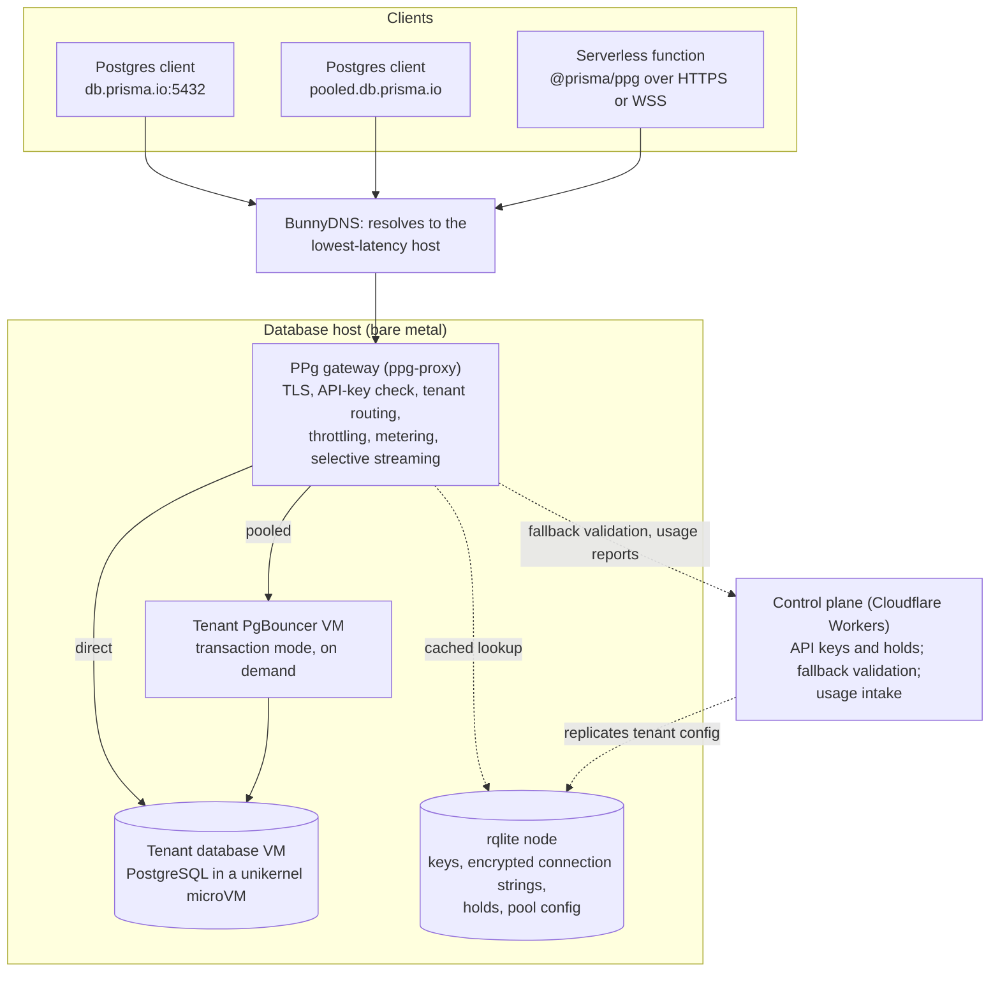

_This is the first post in a four-part series on how Prisma Postgres handles database connectivity. The next installment covers connection pooling: [Why serverless apps are hard on Postgres connections](/why-serverless-apps-are-hard-on-postgres-connections)._

After reading this post, you'll understand what sits between your application and a Prisma Postgres database, and why that component has to do far more than relay bytes.

Start with the connection string. A [Prisma Postgres](https://www.prisma.io/docs/postgres) database gives you something that looks completely ordinary:

```text
postgres://<user>:<api-key>@db.prisma.io:5432/postgres?sslmode=require
```

`psql` accepts it. So do node-postgres, Drizzle, Kysely, DBeaver, and Prisma ORM. That ordinariness is the point of the product, and it hides a real question: where does that TCP connection actually go? There is no single Postgres server at `db.prisma.io`. There are bare-metal hosts in several regions, and each host runs a large number of isolated database instances, one per customer database, as unikernel microVMs. (Nikolas Burk described that hosting design when Prisma Postgres launched, in [Building a Modern PostgreSQL Service Using Unikernels and MicroVMs](https://www.prisma.io/blog/announcing-prisma-postgres-early-access), and followed it with [a walk through the life of a query](https://www.prisma.io/blog/cloudflare-unikernels-and-bare-metal-life-of-a-prisma-postgres-query). This series takes the hosting layer as given and stays on the connection path.) Your database is one of those VMs, on one of those hosts, in one region, and the hostname you connect to knows nothing about which one.

Something has to close that gap on every connection. In Prisma Postgres that something is a gateway service the team calls the PPg TCP Proxy, and this post is about why it exists and what it is responsible for.

## The naive design and where it breaks

Suppose you tried to run a multi-tenant Postgres platform without a gateway. Each database VM listens on its own port, DNS points customers at their VM, and the database's own authentication handles access. This works for one host and a handful of databases. It stops working along four separate axes as soon as the platform is real.

**Routing.** A database lives on one host, but the customer should reach it from anywhere. If DNS resolves to the host nearest the client, that host is often not the one holding the database. Someone has to know where the database is right now, and that knowledge changes when databases are created, restored, moved, or when a host is drained for maintenance.

**Isolation.** Hundreds or thousands of customer databases share a host. Exposing each VM's Postgres port directly means every VM is a separate attack surface, every VM does its own TLS termination, and a misconfiguration on one VM is a public-facing mistake. The platform also loses the ability to reason about who is connecting to what.

**Credentials.** The connection string above carries an API key, not the Postgres password of the underlying database. Keeping those two things separate is deliberate: a customer can create and revoke keys per environment without the database's own credentials ever leaving the platform. That separation needs a component that can accept one credential from the client and present another to the database.

**Abuse and operations.** Postgres has a hard cap on concurrent connections, and one tenant's connection storm should not take down its neighbors on the same host. A rolling upgrade should not cut every session on a host at once. When something breaks, the operator needs to know whether the failure was the platform's fault or the client's. None of these concerns can be handled by the database process itself.

Each of these problems can be solved in isolation. The interesting decision is where to solve them together.

## The gateway as a deliberate boundary

Prisma runs one gateway process on every database host. Every client-facing connection to a Prisma Postgres database enters through it, whether the client speaks the raw Postgres wire protocol over TCP, connects through the pooled hostname, or uses the serverless driver over HTTP or WebSockets. The three paths differ in what happens after the gateway accepts the connection, and later posts cover those differences. What they share is the boundary.

For a direct TCP connection, the gateway's work on each new session looks like this:

1. Accept the TCP connection and negotiate TLS. The client's `SSLRequest` is handled here, not by the database VM.
2. Read the Postgres startup message and ask the client for its credentials. The password field carries the API key.
3. Resolve the tenant. The gateway looks up the key's hash and the database's location and connection parameters from a configuration store that is replicated to every host.
4. Open a connection to the database VM and authenticate to it with the platform-held credentials, using Postgres's own SCRAM-SHA-256 exchange. The client never sees those credentials.
5. Tell the client it is authenticated, then stream bytes in both directions for the rest of the session, inspecting only a few message types along the way.

A conceptual view of the pieces involved:



_Conceptual view of the connection path. Every client path enters the gateway on a database host; the gateway resolves the tenant from a locally replicated configuration store and connects to the database VM directly or through the tenant's pooler. Not every service is shown._

Two things about this layout matter for the rest of the series. First, the gateway and the database VM are on the same physical host in the common case, so the hop from gateway to database is local. The network cost a client pays is the round trip to the nearest gateway; when DNS lands a client on a host that does not hold its database, the gateway connects onward to the host that does. Second, the documented way to reach a database VM is through this ingress. Customers do not get host access, and the gateway's own administrative and metrics endpoints sit behind a separate, token-gated port that is not reachable directly from the internet. A gateway is what makes it possible to treat "the database is reachable only through a controlled path" as a design property rather than a hope.

## What the gateway gives you

It is tempting to describe a proxy by its mechanics. The more useful description is what each responsibility does for the person on either side of it.

### Authentication without sharing database credentials

The credential a client presents is a tenant identifier plus an API key. The gateway validates the key against a stored hash and, on success, authenticates to the database using credentials that are stored encrypted in the platform's configuration store and decrypted only inside the gateway. Environment-scoped keys can be added and revoked independently, and revoking one does not require touching the database's own role or password.

There is a cost to this indirection, and it is worth being precise about it. The gateway caches lookup results for a short window so that a burst of connections from one tenant does not turn into a burst of lookups. A revoked key can therefore keep working for a bounded number of seconds until that cache entry expires. That is a conscious tradeoff between revocation latency and lookup load, not an accident.

### Tenant routing that survives change

Because the gateway resolves the database location on every new connection, databases can move without customers changing anything. The routing data lives in a small replicated SQLite cluster, [rqlite](https://rqlite.io/), with a node on every host, which means a gateway can answer "where is this database and how do I authenticate to it" with a local read most of the time. The section on hard parts below returns to what that costs.

### Usage visibility and fair accounting

Every connection through the gateway is metered: how many queries it executed, how many bytes went in and out, how long the handshake took, how long the session lived, and which errors occurred. That data feeds three things that are easy to conflate:

- **Your usage.** Prisma Postgres bills on database operations and storage. The operation count comes from the gateway's per-connection query metering. Storage is measured inside the database VM, not at the gateway, and backups flow from the VM to object storage on a separate path that never touches the gateway.
- **Fair resource accounting.** The same counters tell the platform which tenant is generating load on a host, which is what makes the throttling described below possible.
- **Operational safety.** Error counts are classified at the gateway as either the client's problem (a bad password, a malformed startup message, a SQL error) or the platform's problem (an unreachable upstream, a protocol error mid-stream). Only the second kind counts against the service's availability objective.

### Throttling that protects neighbors

The gateway enforces limits in two phases. After authentication, each tenant gets a bounded number of concurrent connections on a host; exceeding it returns the standard Postgres "too many connections" error (`53300`) with a retry hint rather than a dropped socket. Before TLS, the gateway watches its own handshake latency and total connection count and, when the host is under stress, sheds a fraction of new connections outright. Between those two, per-tenant limits shrink when the host is degraded, and a tenant that keeps generating connection-limit errors is automatically slowed down further.

Operators can also place holds on a tenant, full or partial, from the control plane, and on the TCP path the gateway re-checks them on every query rather than only at connect time. (The serverless path checked holds only at connect time until the redesign in Post 4, which closes that gap.) The distinction the team draws here is a useful one for anyone designing limits: throttling that enforces a plan limit is expected behavior, but throttling that fires because the platform itself is overloaded counts as an availability failure, because it means the platform should have had more capacity.

### One place to observe

Because every connection crosses the gateway, it is also where the service-level objectives are defined and measured: connection success rate, execution success rate, handshake latency, and the fraction of time the host spends outside its normal throttle mode, evaluated per region as well as fleet-wide. A gateway that only relayed bytes could report throughput. A gateway that understands the protocol can tell you that a session failed after the client had already started a transaction, which is the failure that actually hurts.

## The parts that are hard

Colocating these responsibilities is the easy decision. Three consequences of it are hard, and they shape the rest of this series.

**Distributing the routing data.** The gateway needs the answer to "where is this database" on every host, within a bounded delay of any change, without adding a network round trip to every connection. The current answer is the replicated store plus short-lived per-host caches with request coalescing, so that a thousand simultaneous connections from one tenant produce one lookup rather than a thousand. Every cache is a tradeoff between freshness and load, and the revocation window above is one visible consequence.

**The protocol is message-oriented, and the libraries want to buffer.** The [Postgres wire protocol](https://www.postgresql.org/docs/current/protocol-overview.html) is a stream of typed, length-prefixed messages. A gateway that needs to count queries, catch errors, and capture the key needed to cancel a running query has to look inside some messages. The common Go libraries read whole messages into memory before handing them over, which is fine for a small `ErrorResponse` and unacceptable for a multi-gigabyte `COPY`. Prisma's gateway therefore does its own framing: it reads the five-byte header, decides whether the message is one of the few it needs to inspect, and otherwise streams the body straight through without allocating. The proxy's own test suite includes a case that pushes a gigabyte of `COPY` data through the gateway and asserts that memory barely moves. Post 3 and Post 4 are largely about what it takes to keep that property while adding features.

**Buffering and noisy neighbors.** Anything the gateway holds in memory on behalf of one connection is memory another tenant on the same host cannot use. Horizontal scaling hides this problem, since more instances mean each one holds less, but it does not remove it. The team has learned this from operating an earlier managed proxy: scaling a connection pool horizontally caused user-visible slowness, and the replacement they have designed scales vertically alongside each database VM instead. The safest buffer is the one you never allocate, which is why the streaming discipline above is treated as a constraint rather than an optimization.

> **Sidebar: observability is load too.** A gateway that sees every connection is also a gateway that can emit a log line and a trace span for every connection, and at fleet scale that volume becomes a workload in its own right. Two documented facts from the proxy's own history make the point. Its logger writes through an asynchronous ring buffer that drops lines when the sink cannot keep up, and it counts what it dropped, because blocking the data path on log I/O would be worse. And one cleanup commit removed duplicate tracing spans that a stack of instrumentation wrappers had been emitting for the same logical operation, cutting several million spans a day. Neither is a heroic story. Both are the kind of thing a gateway forces you to get right.

## Takeaway

A multi-tenant database service needs a controlled connection boundary, and that boundary has to authenticate, route, meter, throttle, and observe every session, not just forward it. Putting those responsibilities in one process per host is a deliberate choice: it gives the platform one place to enforce policy and one place to measure, at the cost of making that process the component that must stream efficiently, cache carefully, and never become the bottleneck it exists to prevent.

The gateway establishes the boundary. It does not, by itself, solve the problem that brings most people to a managed Postgres service in the first place: what happens when a burst of short-lived compute instances all want a connection at once. That is the subject of the next post.
