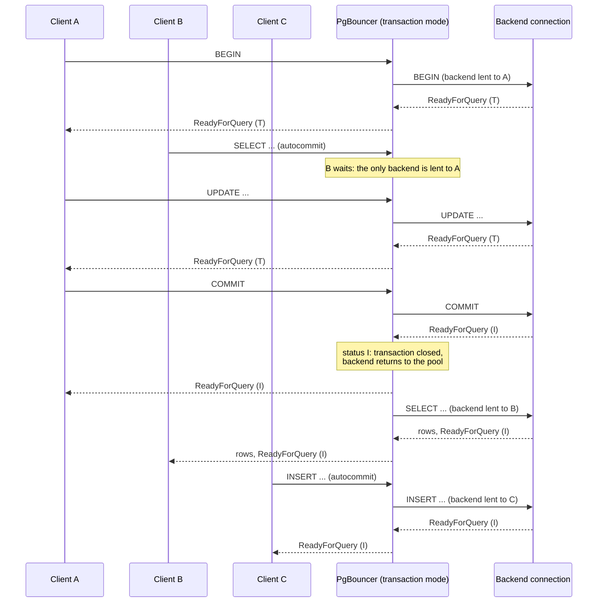

_This is the second post in a four-part series on how Prisma Postgres handles database connectivity. The [first post](/why-prisma-postgres-needs-a-gateway) explained the gateway that every connection passes through. This one is about what happens on the other side of it when the clients are short-lived._

After reading this post, you'll understand why bursts of short-lived compute put pressure on Postgres connections, and exactly which part of that problem connection pooling addresses.

Here is the scenario. You deploy an API handler to a serverless platform. It opens a Postgres connection, runs two or three queries, and returns. The platform is generous with concurrency: a traffic spike of a few hundred simultaneous requests is handled by starting a few hundred instances of your handler. Each instance dutifully opens its own database connection. On a long-running server this would be one process with a pool of, say, ten connections serving all of that traffic. On the serverless platform it is a few hundred connection attempts arriving at once, most of them for a single query, and the database's answer to the ones past its limit is a hard error:

```text
FATAL: too many connections for role "app"
```

Nothing about the queries was expensive. The database was not CPU-bound. It was connection-bound, and that distinction is the whole subject of this post.

## Why a Postgres connection is not a cheap thing

Postgres uses a process-per-connection model: the postmaster forks a new backend process for every client session, and that backend holds the session's state for as long as the client stays connected. The [PostgreSQL documentation](https://www.postgresql.org/docs/current/connect-estab.html) describes this directly, and it explains three consequences that matter here.

First, establishing a session costs more than a TCP handshake. The client and server exchange a startup message, negotiate authentication (SCRAM-SHA-256 by default on modern setups), and the server sets up a backend with its own memory. Over TLS, and across a network, that is several sequential round trips before the first query byte is processed.

Second, every open session consumes server memory and a slot in a fixed table. The `max_connections` setting is chosen at server start, and the server sizes shared resources based on it, so it is not something a managed service can simply raise on demand. On Prisma Postgres the limit is set per plan, and the application role is allowed only a fraction of it, with the remainder reserved for migrations and platform operations. The [connection pooling documentation](https://www.prisma.io/docs/postgres/database/connection-pooling) lists the current per-plan numbers.

Third, and least obvious: a connection that is open but idle is still a backend process. Serverless platforms keep instances warm between invocations precisely so the next request is fast, and a warm instance that opened a connection keeps holding it. Which brings us to the shape of the traffic.

## What "short-lived compute" actually does to connections

It is tempting to say that every serverless invocation starts a new process and opens a new connection. That is not what the major platforms do, and the real behavior is what makes the problem hard to reason about.

On AWS Lambda, an execution environment is frozen after an invocation and thawed for the next one, so a database connection declared outside the handler is reused across warm invocations. AWS's own guidance is to check whether a connection exists before creating one. But Lambda provisions a separate execution environment for every concurrent request, and it terminates environments every few hours even for continuously invoked functions. Concurrency therefore maps almost directly to open connections, and a burst of two hundred concurrent requests is two hundred environments, each with its own connection, whether or not any single environment is reused later.

Vercel's Fluid Compute changes the shape again: multiple concurrent invocations can share one function instance, so a pool declared in module scope can serve several requests at once, and Vercel documents a helper that closes idle connections before an instance suspends. Cloudflare Workers can open outbound TCP sockets with the `connect()` API, but a socket cannot be created in global scope and shared across requests, and Cloudflare's own recommendation for Postgres is to go through a pooling layer.

The common thread is not "no reuse". It is that the application does not control the lifetime of the thing holding the connection. Instances come and go on the platform's schedule, concurrency fans out into instances rather than into threads, and idle instances hold idle connections you cannot see. A pool inside one instance helps that instance and does nothing across instances. The connection budget has to be managed somewhere the platform's scaling cannot outrun.

## What pooling does, precisely

A connection pooler is a process that sits between clients and the database, holds a fixed set of authenticated backend connections open, and lends them to client sessions. Clients see a Postgres server. The database sees a small, stable number of sessions. The pooler's job is to decide when a backend connection can be handed from one client to another, and that decision is the entire design space.

[PgBouncer](https://www.pgbouncer.org/), the pooler Prisma Postgres uses today, offers three answers, which its [feature documentation](https://www.pgbouncer.org/features.html) defines as follows:

| Mode | When a backend connection returns to the pool | What a client can rely on |
| --- | --- | --- |
| Session | When the client disconnects | Everything: `SET`, prepared statements, temp tables, `LISTEN`, advisory locks all persist for the session |
| Transaction | When the current transaction ends | Only what lives inside a transaction. Session-level state is lost between transactions |
| Statement | When each statement finishes | Single statements only. Multi-statement transactions are rejected |

Session mode barely pools at all: it saves the backend setup cost when a client reconnects, but a thousand connected clients still need a thousand backends. Statement mode pools aggressively but breaks transactions, which rules it out for most applications. Transaction mode is the common choice because a transaction is the smallest unit that still lets an application reason about atomicity, and because most application sessions spend most of their time between transactions.

Here is what reuse looks like in transaction mode with three clients and one backend connection:



_Transaction-mode reuse with three clients and one backend connection. The pooler hands the backend to the next client only after Postgres reports the transaction closed in the status byte of its ReadyForQuery message. Simplified: a real pool holds more than one backend._

Client A holds the backend from `BEGIN` to `COMMIT`. The moment Postgres reports the transaction closed, the pooler can hand the same backend to client B's autocommit statement, and then to client C. Three application sessions, one backend, and none of them waited on connection setup to the database. The reason the pooler can do this safely is a detail of the wire protocol: after every query cycle Postgres sends a `ReadyForQuery` message whose status byte says whether the session is idle, inside a transaction, or inside a failed transaction. Transaction pooling is built on reading that one byte. Post 4 comes back to it.

The cost of this arrangement is equally precise. Anything a client sets on the session outside a transaction lands on whichever backend it happened to be holding, and the next transaction may get a different one. That is why the Prisma Postgres documentation says session state such as `SET` commands, prepared statements, advisory locks, and temporary tables are lost after each transaction boundary on pooled connections, and directs workloads that need them to a direct connection. (PgBouncer can track protocol-level prepared statements across backends when configured to, but that does not change the general rule: assume nothing survives the transaction.)

## How Prisma Postgres pools today

On Prisma Postgres, pooling is opt-in by hostname. The direct connection string points at `db.prisma.io`; the pooled one points at `pooled.db.prisma.io`. Both arrive at the gateway from Post 1. For a pooled connection the gateway routes to a PgBouncer instance that belongs to that one tenant, running in transaction mode, in front of the tenant's database VM:

```text
Application → gateway → tenant's PgBouncer (transaction mode) → database VM
```

Two properties of that arrangement are worth knowing because they shape its behavior.

**The pooler is per tenant and starts on demand.** Each PgBouncer runs as its own microVM on the same host as the database, provisioned the first time a pooled connection arrives and frozen after a few seconds of inactivity, the same scale-to-zero mechanism the database VMs use. That isolates one tenant's pool from another's, and it means the first pooled connection to an idle database pays a provisioning or wake cost that later ones do not. The pool's minimum size is zero for the same reason: a pool that eagerly reopens backends would keep waking its database.

**The limits are plan-sized.** PgBouncer has two independent knobs: how many clients may connect to it and how many backend connections it may hold. Prisma sizes both per plan, and the backend pool is smaller than the database's `max_connections`, so the pooler can never itself exhaust the database. The documentation publishes the client-side limits per plan, the 10-minute cap on a pooled query, and the 60-minute idle timeout on pooled sessions.

The gateway itself holds no pool. It opens a fresh connection to PgBouncer for each client session and streams. That is a deliberate scoping: the gateway's job in this arrangement is routing and policy, and PgBouncer's is reuse. It also has a consequence for latency, which the next section is about.

## What pooling fixes, and what it does not

It is worth stating the non-goals plainly, because "connection pooling" is often described as if it made queries faster.

**Pooling does not change query execution time.** A pooled `SELECT` runs the same plan on the same backend as a direct one. If a query is slow inside Postgres, a pooler cannot help.

**Pooling does not reduce the client's connection setup cost on this path.** Count the sequential round trips a client pays before its first query byte: one for TCP, one for TLS, and two for the Postgres startup and password exchange with the gateway. Those happen at the full client-to-gateway latency in both modes, because the gateway terminates the client's session either way. What changes is the leg behind the gateway: with PgBouncer warm and a backend idle in its pool, the pooler answers the startup without opening a new database session, whereas a direct connection performs a fresh handshake and SCRAM exchange with the database. That leg is local to the host, so the saving is real but small relative to the client-facing round trips. If your client is far from the nearest region, pooling will not make connection setup feel fast; it will make it stop failing.

**Pooling adds a hop.** Every pooled query crosses one more process. On the same host that is a small cost, but it is not zero, and a workload with one long-lived, well-behaved connection gains nothing from it.

**Pooling can add waiting.** When every backend in the pool is busy, the next transaction queues inside PgBouncer instead of failing. That is the intended behavior under a burst, and it is better than a connection error, but it means end-to-end request latency can rise under load even though each query executes just as fast as before. When you measure a pooled workload, separate the time a query spent executing in Postgres from the time the request spent waiting for a backend. The second number is the one pooling controls.

**Pooling reshapes the connection limit rather than lifting it.** The database still has its `max_connections`. What pooling changes is how many application sessions can share it. The [documentation](https://www.prisma.io/docs/postgres/database/connection-pooling) makes the same point: pooling does not increase the database connection limit, it makes better use of it.

> **Sidebar: when the platform fights the pooler.** Running PgBouncer inside a VM that freezes when idle produced a failure mode worth learning from. PgBouncer keeps its backend connections open across client sessions, and it uses the monotonic clock to decide when an idle backend is old enough to be checked or closed. A frozen VM's monotonic clock stops. Meanwhile, the host's ingress closed the frozen pooler's long-idle connections to the database after a couple of hours, and because the pooler was the side that had opened those connections, it was not woken to see them close. On the next thaw, PgBouncer's timers reported almost no time elapsed, it handed a dead backend to a client, and the client saw `server conn crashed?` (SQLSTATE `08P01`). The mitigation is PgBouncer's own health check with no delay: before reusing a backend, send the empty query string, which Postgres answers with `EmptyQueryResponse` without touching the planner or the statistics views. The platform vendor has said it will wake both ends of a closed connection in a future fix. Until then, the lesson is that a pooler's idea of "idle for a while" has to survive the platform's idea of "asleep".

## Where Accelerate fits, and where it is going

Readers who have used Prisma for a while know an older answer to this problem. Prisma's Data Proxy, introduced in [Early Access in 2021](https://www.prisma.io/blog/prisma-data-proxy-xb16ba0p21), ran the Prisma query engine and a connection pool on Prisma's side, so that a serverless function could reach the database without holding a Postgres connection of its own. It [became Accelerate in 2023](https://www.prisma.io/blog/announcing-accelerate-usrvpi6sfkv4), which added a global cache. Accelerate is a different design from the pooler described above: the client speaks Prisma's query protocol over HTTPS to an edge worker, which forwards to a query engine instance near the database, and that engine holds a small pool of persistent connections to the database. The pool lives in the engine, not in front of the database.

That design has served a lot of traffic, and it taught the team things the next post relies on. It is also being wound down: Prisma's [documentation](https://www.prisma.io/docs/accelerate) states that hosted Accelerate connections will be retired on December 1, 2026, that Prisma Postgres includes connection pooling, and that query caching is not carried over. The two paths forward are the pooled TCP hostname above and the serverless driver that Post 3 covers.

One more thing is in progress and belongs in the roadmap column rather than the current one. The gateway's redesign, which Post 4 describes, includes an embedded transaction pool inside the gateway process itself, so that the pooler is no longer a separate microVM. That code exists and is tested in the new codebase, but its design is still under review and it is not what serves production pooled traffic at the time of writing.

## Takeaway

A connection pooler manages access to a finite set of backend connections. That is the whole job, and it is a valuable one when the number of things wanting a connection is decided by a platform's scaling behavior rather than by you. To judge whether pooling helps a workload, separate two costs that get conflated: the cost of establishing and holding connections, which pooling addresses, and the time queries spend executing in Postgres, which it does not. If the first number dominates, pool. If the second does, look at the queries.

Pooling assumes one thing throughout: that the client can open a Postgres connection at all. Some runtimes cannot, or can only do so awkwardly, and even where they can, a request-scoped function is a poor fit for a protocol designed around long-lived sessions. That is the transport problem, and the next post is about the API Prisma built to solve it.
